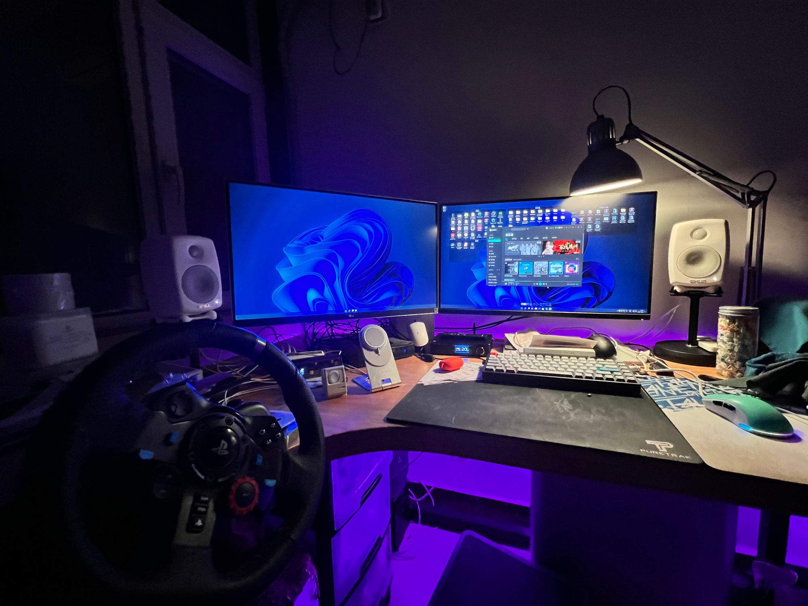
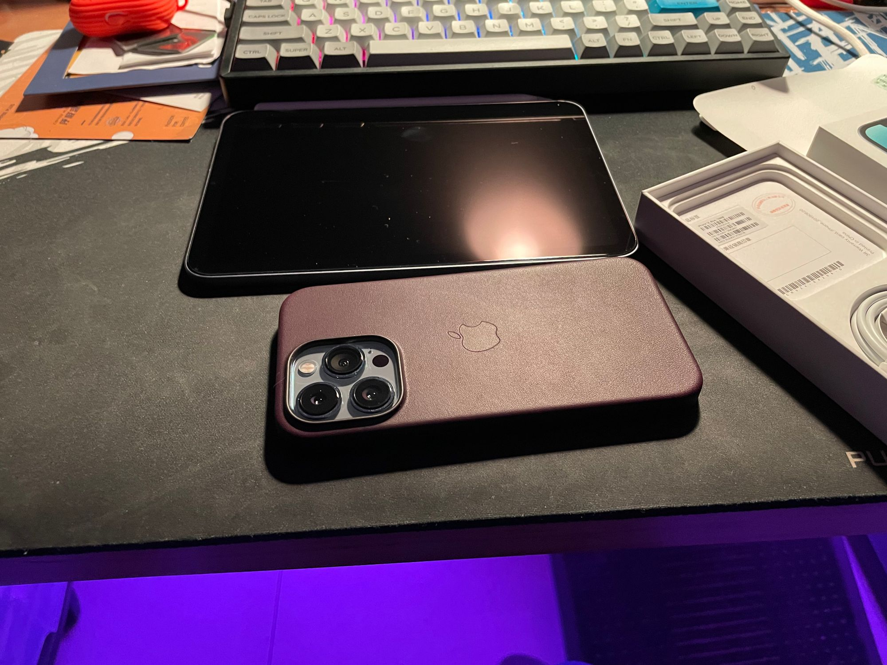
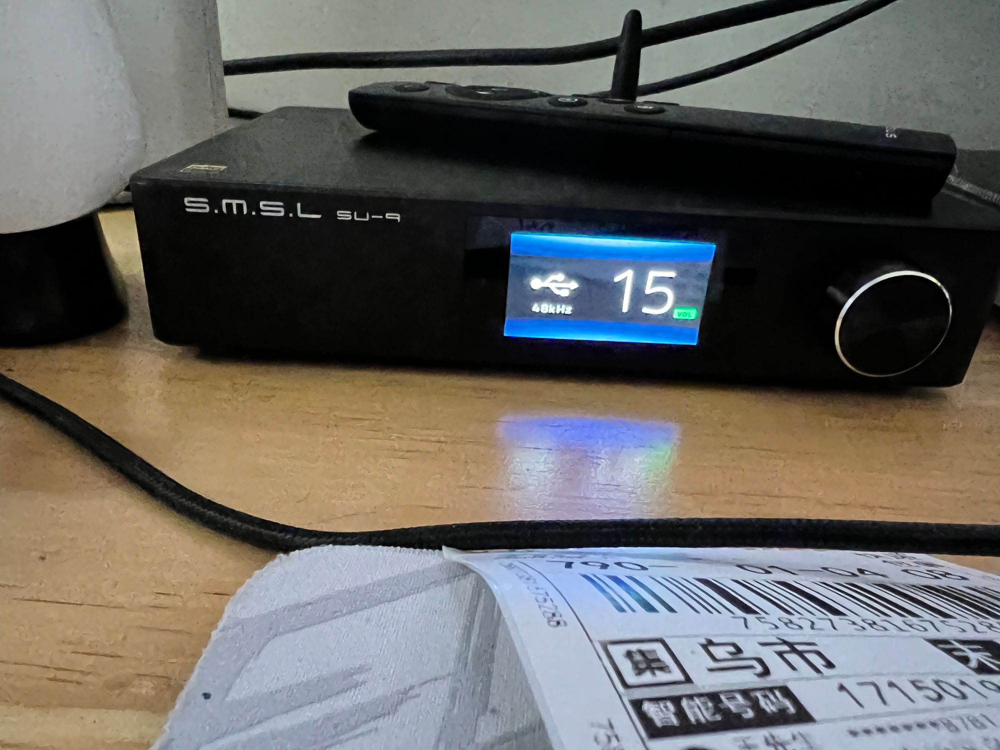
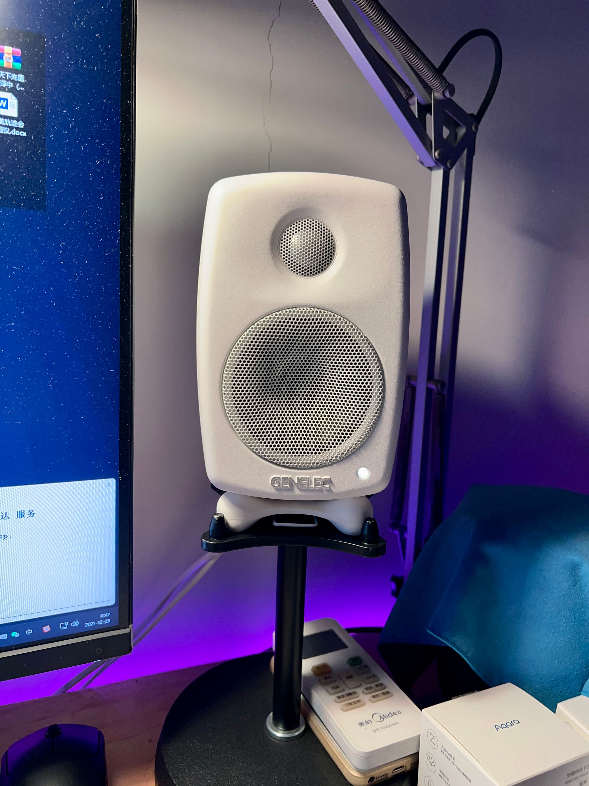

又是距离半年时间更新Blog，这快成我的惯例，其实常常想写些什么，但不知道从哪里动笔。现在又一年一度的写总结和展望时候，此刻心情很复杂。

## 2021 回顾

总的来说今年还是一个对自己不太满意的一年，对自己的期望没达到，一整年时间，做成了什么事情？达成了什么成就？认知有什么提升？回想起来并没有多少值得一提的，只能写写一些生活小事。

今年各方面感受比在去年回顾时感觉更加强烈。

- [回顾2020，展望2021](https://hansendong.life/p/2020/12/2020-retro/)

### 疫情

2020年因为COVID-19，对世界上的很多人影响深远，有的人因为疫情家庭骤变，有的人失去工作，或是更多人失去生命。很庆幸的，我跟家人都还安全的生活在这地球上，年初石家庄出现了输入性疫情并形成不小的传播，人心惶惶，经过政府及市民的努力，很快得到了控制没有锁城，没有持续不减的疫情。真的，很幸运。

### 工作

由于疫情依然在全球肆虐，今年各种政策轰炸，行业一个个整顿和暴跌，导致很多行业不景气，很多巨头公司开始裁员，让很多人失去工作。

今年年中就预感不好尝试突破，更换了一起共事3年的合作伙伴，没想到是今年冬天遇到非常强大的奥密克戎变种，疫情再次严峻起来。随之发现人们在面临未来的不确定感，开始存钱，消费降级。联动的我的生意收到不小的影响。

应对现状，在11月初尝试接触新品牌签约经销，到目前没有看到明显的改善。这个冬天很艰难。

这一年拿到很多我喜欢的产品，投入了不少银子。例如真力G1有源音箱、三木双林SU-9音频解码器、咖乐美全自动咖啡机、iPhone 13 Pro 256G、iPad mini第六代、威联通QNRP NAS等。这些都想写写感受，但犯懒不想写。
  

不过威联通nas在5月时候已经完成了，感兴趣的可以去看看。

- [NAS从两盘群辉DS216play更新到九盘威联通TVS-951N的历日旷久之路](https://hansendong.life/p/2021/05/nas-updated-from-synology-ds216play-to-qnap-tvs951n/)

## 2022 展望

继续去年的多存钱，少花钱，冲动是魔鬼。

2021已经结束，期间有欢笑、有泪水、有感动、有难过，但生活仍要继续。回顾去年的各个事件，是为了今年能更好的出发。