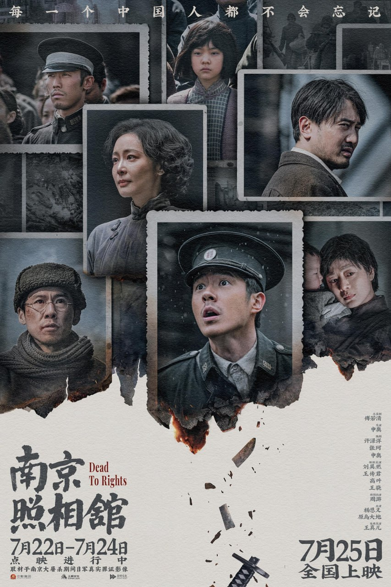



## 为什么偏偏选在8月15日

上周六就是2026年8月15日，日本投降81周年。我特意选了那天晚上，关了家里所有的灯，窝在沙发上，用平板看完了这部拖了一年多才敢看的电影——《南京照相馆》。2025年上映的时候，朋友圈里好多人说哭到缓不过来，我一直没点开。选这样一个日子来看，大概是觉得，有些事情拖太久，终究要面对。

两个半小时。那天看完的时候窗外已经黑透了，我坐了很久，起身去厨房倒了杯水，凉了，没喝。

## 暗房里的一群"胆小鬼"

电影讲的是1937年南京沦陷后，一群躲在吉祥照相馆里的普通人。他们被一个日本随军摄影师征用，每天帮着冲洗日军拍的胶卷。暗房里的红光，药水的气味，每个人小心翼翼的呼吸——他们以为只要听话就能活下去。直到有一天，他们发现正在冲洗的底片上，是自己认识的邻居、老师、杂货铺老板，以各种各样的姿势倒在血泊里。

他们开始偷偷做一件事：每冲一份日军的底片，就多洗一份藏起来。没有人商量过这么做，但每个人都默契地做了。

这电影真正刺痛我的，不是那些屠杀画面——导演其实拍得很克制。让我难受的，是它把"普通人怎么活下来"这件事拍得太真实了。刘昊然演的邮差阿昌，一开始只想着怎么偷渡出城，怎么换点吃的，他甚至劝照相馆老板别多事，"咱们连自己都保不住"。高叶演的女演员毓秀，漂亮，怯弱，在日本人面前本能地低着头。你会觉得，这不就是我们吗？大难临头的时候，谁不是先想着自己？

但就是这些人，在看到底片上那些面孔的瞬间，什么都没说，开始做一件更笨的事情——把底片留下来。他们没有宏大的口号，没有英雄式的对白，只是在一个又一个深夜里，在暗房的红光中，一只手递过底片，另一只手接住，藏进墙缝里。

## 那个戴金丝眼镜的摄影师

电影里有一个细节我反复想起来。那个日本摄影师伊藤，戴着斯文的金丝边眼镜，说话轻声细语，看起来像个艺术家。但他手里的相机，拍下了"百人斩"的全过程，冲洗出来，再标注日期，像在整理一件作品。这种文明外壳下的恶，比面目狰狞的侵略者更让人后背发凉。它让你意识到，真正的恐怖不是癫狂，而是把杀人当作日常。

有一场戏，伊藤请照相馆的人一起"欣赏"他拍的照片，照片上是堆积的尸体。他微笑着问："构图怎么样？"那个瞬间，暗房里所有人都沉默了，银幕前的我也屏住了呼吸。这种平静的残忍，比任何嘶吼都让人不寒而栗。

## 幕布拉开，山河破碎

但真正让我绷不住的，是最后那场戏。照相馆老板老金拉开摄影棚的背景幕布——北京故宫、杭州西湖、武汉黄鹤楼，一幅幅山河画卷缓缓展开。狭小的房间里，一群绝望的人站在那里，背后是破碎前的中国。阿昌突然怒吼着喊出一个个地名："中华门——紫金山——挹江门——"最后那句"我们中国人不许可你们这么糟蹋"，我一个人在黑暗里，眼泪直接砸在平板上。

那一瞬间，我突然理解了"家国"这两个字。不是课本上的概念，而是你站在一块幕布前，看着自己本该拥有的山河，被一寸一寸踏碎。那种无力感和愤怒，混合在一起，堵在胸口，吐不出来。

## 那个15岁的学徒，和"京字第一号证据"

片尾字幕升起的时候我才知道，这个故事有一个真实原型。1937年，南京一家照相馆的15岁学徒罗瑾，在帮日军冲洗照片时，冒着杀头的风险多洗了一份罪证，藏在一本相册里。后来这本相册辗转到了远东国际军事法庭，成为指控南京大屠杀的"京字第一号证据"。现在还在中国第二历史档案馆里。

我立刻用手机搜了罗瑾这个名字。资料很少，只有短短几行字，说他在晚年几乎不提这段经历。我想象一个15岁的孩子，在暗房里一边发抖一边把底片塞进怀里，走出门的时候还要装作若无其事。他后来过完了普通的一生，但那份底片，替无数死去的人说了话。

## 81年后，我一个人坐在黑暗里

2026年，距离1945年日本投降，整整81年。距离那个15岁少年颤抖着手藏起底片的夜晚，已经过去了89年。

我关掉平板的时候，屏幕上倒映出我自己。突然觉得，那个暗房里的一小片红光，隔着近一个世纪的距离，照到了我一个人独居的客厅里。那些底片上的人，那个照相馆里的所有人，最后大多没能活着走出南京城。但他们留下的东西，让世界知道了真相。

81年了。我没有在纪念日喊过任何口号，也觉得仇恨不应该一代代传下去。但有些事不该被忘记，不是为了恨谁，而是为了知道——今天我可以一个人安安静静坐在家里看一部电影，不用担心明天还能不能醒来，是一群普通人用命换的。

我没有哭到不能自已。就是关灯之后，在黑暗里坐了很久。

那杯凉掉的水，我最后还是喝了。
