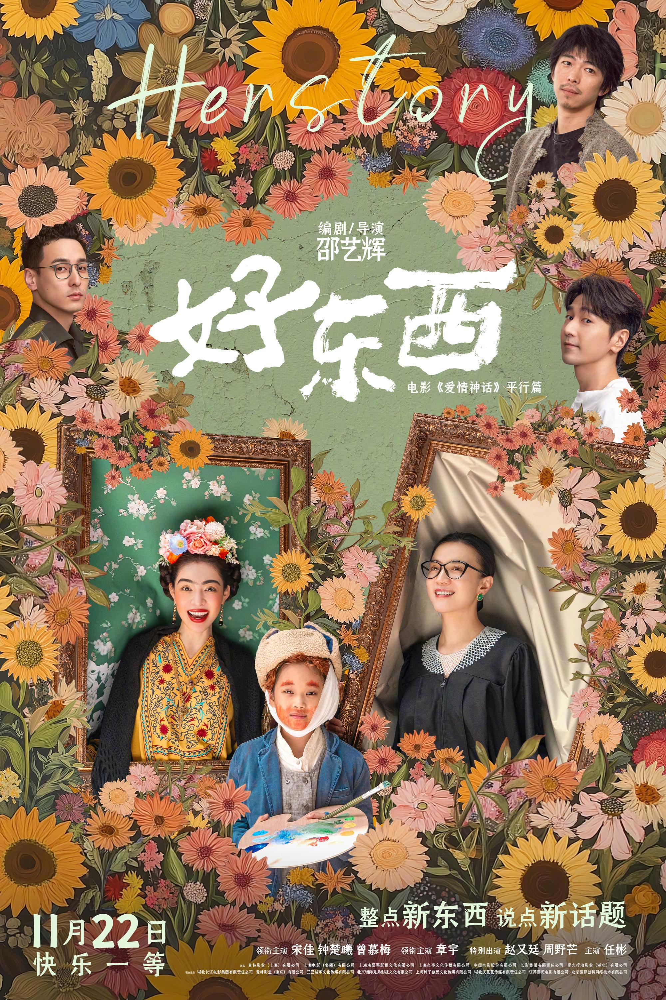



## 剧情简介

《好东西》是一部兼具温暖与幽默的爱情喜剧。邵艺辉以她标志性的女性视角切入，讲述了单亲妈妈王铁梅与邻居女孩小叶之间那段看似平淡、却让人动容的故事。影片不靠反转推进情节，而是把镜头贴近生活本身——柴米油盐、邻里往来、女性在情感与日常里那些细微的张力。看完像读了一篇结构精巧的散文：不浓烈，但留在心里。

## 角色塑造：双女主

宋佳饰演的王铁梅，是那种典型的"硬撑型"单亲妈妈——独立、倔强、爱逞强，把脆弱藏在一层薄薄的硬壳后面。钟楚曦饰演的小叶则恰好相反，年轻、莽撞、不按牌理出牌。两个性格截然不同的人凑到一起，没有戏剧化的争吵与和解，只有日复一日的相处里慢慢长出来的相互依靠。这段女性友谊不依附于任何男性角色，干净、扎实，看完让人相信：女孩子之间的懂得，可以比爱情更深。

## 配角群像

配角写得也用心。王铁梅的前夫戏份不多，但每次出场都能"喜感拉满"——他的"废"是有喜剧节奏的"废"，是那种让人会心一笑、又不至于丑化的分寸感。而女儿的鼓手老师，则像一束慢悠悠发出来的光：不抢戏、不喧哗，王铁梅那条感情弧的转折，离不开他安静地托着。

## 情节设计

最让我印象深刻的两场戏，都不靠台词取胜。**听声戏**把"听"推到台前，让观众用耳朵去"看"一场情感的爆发，无需一字台词却直击人心；而**餐桌对谈**则是另一种功夫——节奏紧、机锋密、对仗漂亮，把编剧的文本功底直接摊在桌上。前者是镜头语言，后者是剧作功夫，一部片子能两样都亮出来，导演的功力可见一斑。

## 主题与反思

更难能可贵的是，《好东西》没有止步于"讲一个好听的故事"。它借王铁梅和小叶的日常，悄悄拆解了当下女性在城市生活中的几道隐形困境：亲密关系的边界、单亲妈妈的处境、原生家庭的牵扯、自我价值的重建。性别议题在影片里不是被高举的口号，而是渗透在每一次对视、每一句反问里的呼吸——这才是真正高级的表达。

## 总评

总的来说，《好东西》是一部能把"轻盈"和"有分量"同时拿捏住的电影。它不卖惨、不煽情，只是诚实地呈现一群女性如何好好生活。如果今晚你只想安安静静看一部好电影，它值得占你的两个小时。
