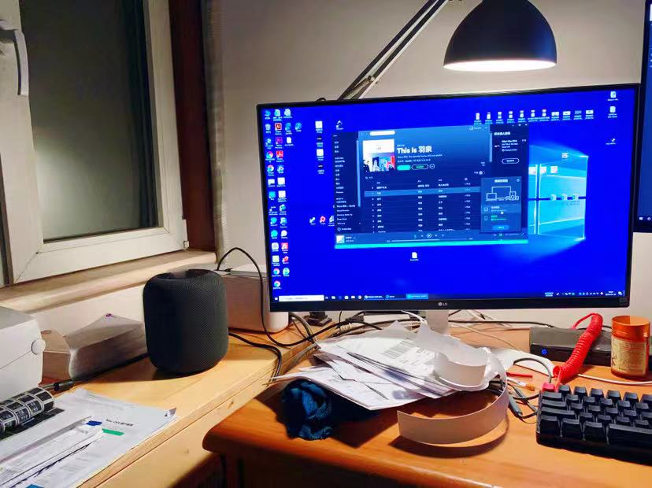
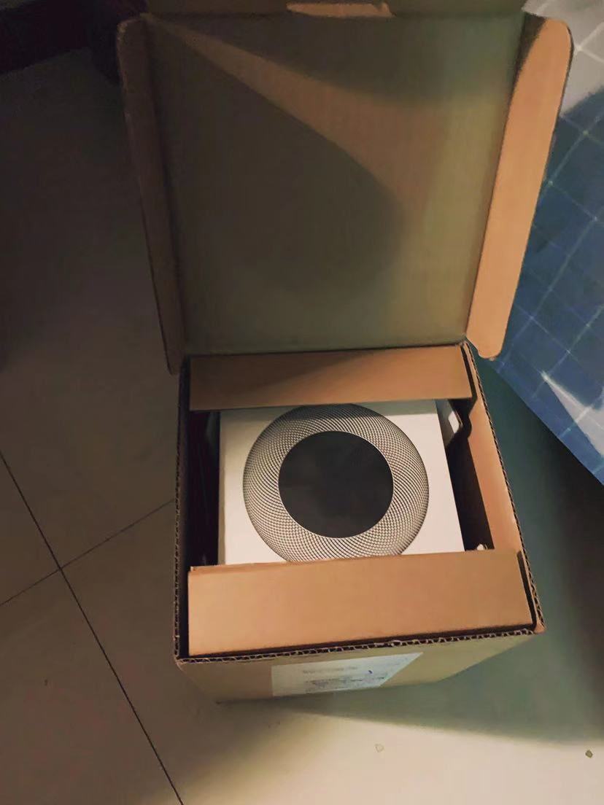
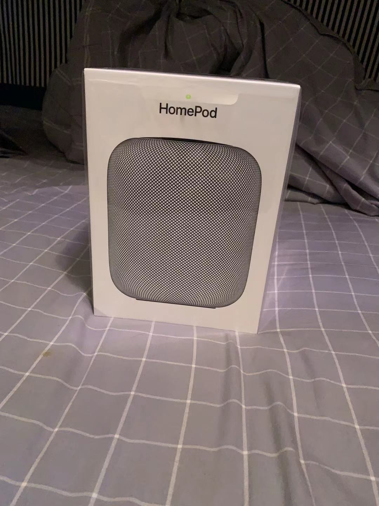
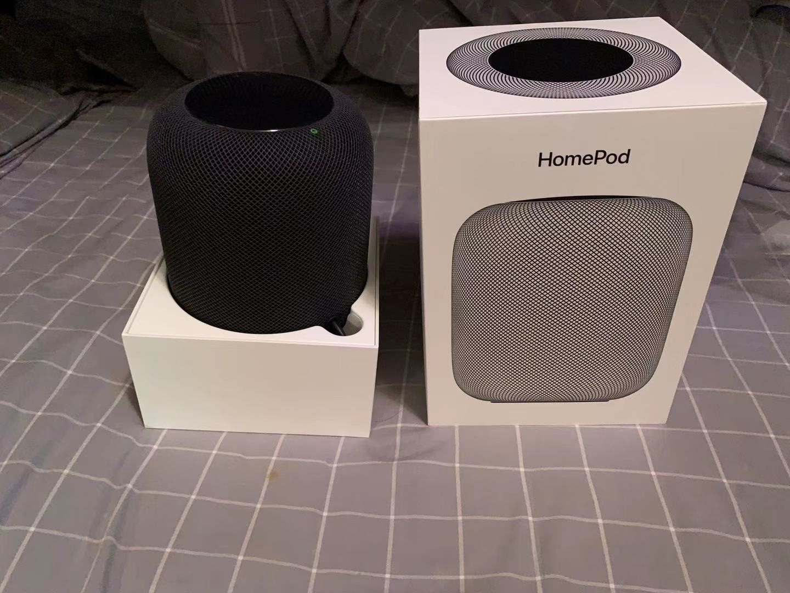

好久不更新Blog，上次更新还是2018年7月份的我的桌面2.0的文章。公司一年的事情终于忙完放假休息了，2018年是不平凡的一年，苦尽甘来，绝地后生。正在用HomePod听着齐秦的歌曲list来写这篇文章，简直是好久没有的惬意。

## 起因

我在2016年2月中旬通过顾客推荐购买了创新的声霸锣2代音箱，此款音箱功能强大，麻雀虽小五脏俱全。例如：蓝牙、音效可切换、充电宝、可链接PS4游戏机及储存卡播放。音质当时觉得很震撼，但经过两年的使用，耳朵已经麻木，总觉得一般般，最近几个月一直换个音箱，提升下音质。

## 经过

看了BOSE mini II代音箱，也看了马歇尔MARSHALL ACTON，也看了索尼的音箱。也知道前几天苹果的HomePod国行上市了，某天无意间刷微博看到了HomePod国行的李大锤大V测评视频，我也有iPhone和MacBook Pro，有冲动想买。 正好朋友在1年前从香港买了澳大利亚版的，仔细的问了他使用感受。朋友说啥都好，但只能限制在苹果生态圈里，非常方便。不支持蓝牙连接。

我目前主力机是Windows系统，经过搜索，国外有两款已经支持Windows连接HomePod的软件。[Airfoil](https://rogueamoeba.com/airfoil/) 和 [TuneBlade](https://www.tuneblade.com/) （注：Airfoil支持Windows和Mac双系统），所以果断在国行发售第一天下单了，其实买任何版本都没有区别，但价格区别不大还是选择了国行版本。从北京发顺丰，第二天就到了。

### 开箱

设计很人性化，开封不用剪刀或者美工刀

开封仍然只需要轻轻的一扯

deng deng deng，露出真面目

iPhone5s IOS12系统以上iPhone靠近HomePod，就会弹出设置选项界面


拿到就迫不期待的开封激活和接上电源连接PC测试，两个软件都亲自测试过了，也购买正版了，相对来说Airfoil贵一些，270多大洋（Windows和Mac双版本 40刀），TuneBlade 70大洋左右（只支持Windows系统 9.99刀)。


> 👆详细的介绍了如何连接Windows系统电脑（包含 Airfoil和TuneBlade）

不过要注意的是，无论两种软件哪款都有2-3秒延迟，这样听歌没有太大影响，但看视频的话，有点不舒服了。两款软件都有调节延迟速度功能，Airfoil更精准一些可达到延迟1秒左右（目前博主主力）

HomePod主打的“嘿，Siri”功能，我到没有经常使用，我没有订阅Apple Music，但唤醒敏感度很高，不会太大声就能唤醒。我更喜欢Spotify，听歌的话，iPhone+AirPlay或者Windows、Mac+Airfoil 连接HomePod。音质的话，个人觉得比之前提高了一个档次（废话，价格高了一倍呢），低音非常好，中音不错，高音一般般。重点说明下，同首歌情况下比之前听到了更多的细节，更加有沉入感。



## 总结

如果你是果粉的话，还用我说吗？肯定买了吧！如果有iPhone，也想要音质的话可以买，如果和我想当电脑音箱的话不建议买了，不是普通人可接受的，可以说有点难受，尤其是在看视频音频不同步时候，我更加推荐马歇尔MARSHALL音箱

PS：我已经习惯，如果今年Apple不更新它的话，明年年初我再买个组双声道

今天是腊月二十三小年，也马上过年，祝各位看官猪年大吉！