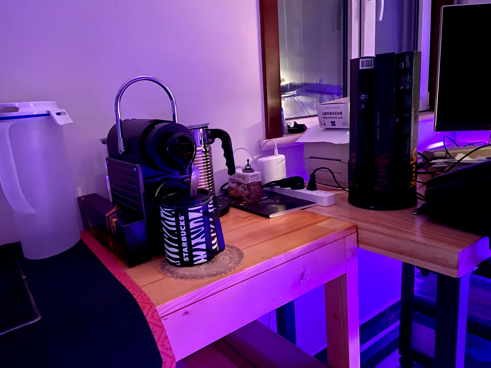

说起购买胶囊咖啡机，是我8月某天无聊打开了小米众筹，看到正在众筹小米自家新推出的胶囊咖啡机，看到价格很便宜，才不到400元，被种草了。然后淘宝搜索了胶囊咖啡机，哇，让我看到了新世界，有各种样式的咖啡机，价格从几百到上万的都有。之前我知道很多人喜欢喝咖啡，自己偶尔点外卖时来一杯，但身边都是去星爸爸、瑞幸咖啡。他们使用的都是大型商用咖啡机，基本上万元起步，根本不知道还可以自己购买咖啡机、咖啡粉制作可口的咖啡。

然后在B站、油管及知乎上了解学习相关知识，知道了「意式」、「美式」、「半自动」、「全自动」等咖啡机，也知道了每天少量摄入咖啡因对身体有益处，因此打算培养喝咖啡习惯。参考了各平台开箱及推荐机型，发现NESPRESSO是胶囊咖啡机发明者，也有近30种不同产地口味的胶囊，在国内卖得最好的品牌。又在B站、油管看了NESPRESSO品牌机型开箱，从C30到D40型号，纠结来纠结去，最后一步到位买了Pixie C61。因为我不太喜欢太苦的咖啡，向客服咨询我适合哪款胶囊咖啡，给我推荐了咖啡师创意之选胶囊咖啡套装。建议我搭配牛奶喝，所以加购了Aeroccino4 冷热奶泡机。

随后我也买了个星爸爸的430ml的斑马纹不锈钢马克杯，179元。还没收到就看到评价说几个月后手柄掉漆，现在被我收藏起来了，用不起。

## 开箱

### 机器与配件

开箱，咖啡机、两套胶囊咖啡（共60颗）、胶囊回收袋、Aeroccino4奶泡机


咖啡机和马克杯搭配，还挺漂亮的。咖啡机两侧和手柄是金属的。很有质感。

### 胶囊口味

客服推荐的胶囊套装，包含：草香闪电泡芙风味、焦糖布蕾风味、松露巧克力风味。


### 奶泡探索

这是第一杯必须纪念下，草香闪电泡芙风味+三元鲜牛奶，奶泡不太成功，后来咨询客服才知道要用纯牛奶才能达到奶泡浓密。


这两杯都是用家里金典纯牛奶打泡混合更好喝，回甘停留更久。不同的口味胶囊


### 燕麦奶升级

前几天看到有人推荐OATLY噢麦力咖啡大师燕麦奶，买回来两瓶1升装的，试喝发现果然不同，升华一个档次，把咖啡原有的浓郁都激发出来了。现在星爸爸也在用它哦。

## 总结

这仅仅是一个简单的开箱及体验，不同人对不同的咖啡，都有不同的个人偏好。「口感」这东西嘛，还是比较偏主观的。

仍然在学习咖啡相关知识，一天一杯拿铁养生，每杯咖啡因50-80mg，每天摄入不建议超过300mg，相当于3-4杯浓缩咖啡。

有关咖啡机、胶囊咖啡的评测，网上已经介绍得很详细了，在这里就不再班门弄斧了。

1. 拥有庞大的胶囊系统，近30种口味自家胶囊和第三方兼容咖啡胶囊
2. 体积小巧，不占空间，方便快捷，万搭各种装修风格。
3. 0.6升大容量水箱，最后一杯咖啡完成后来一杯清水即可清洗，每6个月或300杯建议除垢。
4. 工作时噪音较大。
